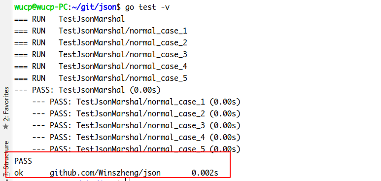
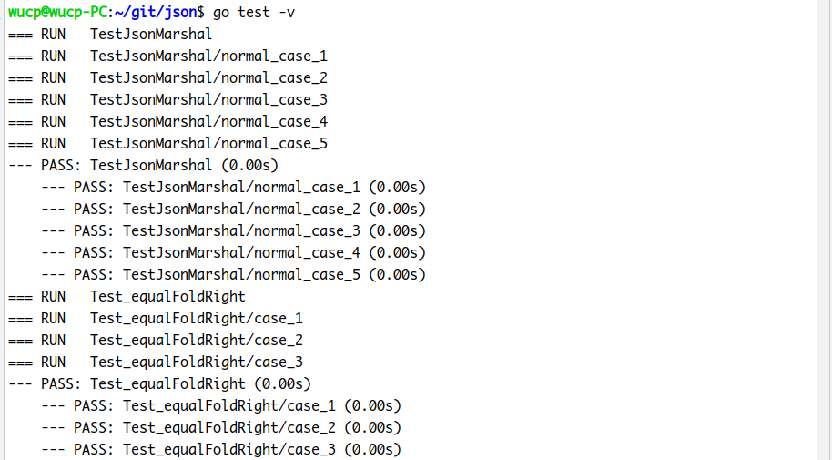
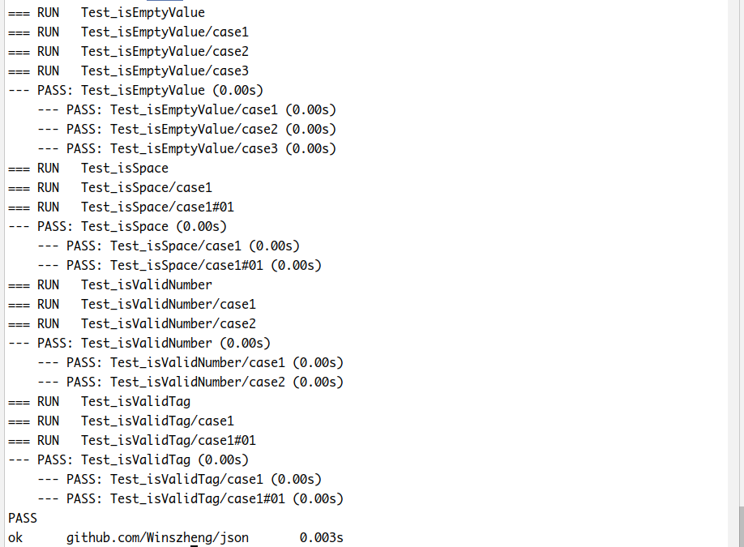
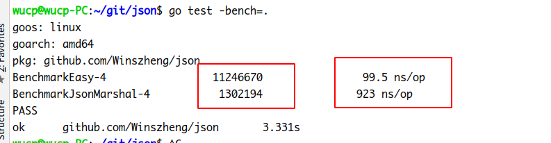
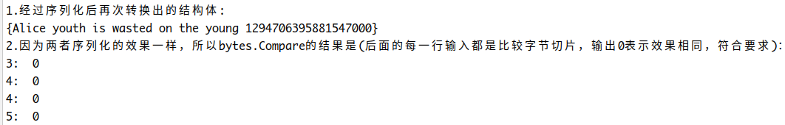
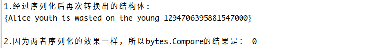

# 一、设计说明

### 1 需求说明

参考官方 encoding/json 包 Marshal 函数，将结构数据格式化为 json 字符流

### 2 开发要求

- 必须导出 `func JsonMarshal(v interface{}) ([]byte, error)`
- 可以参考、甚至复制原来的代码
- 支持字段的标签（Tag），标签满足 `mytag:"你自己的定义"`
- 不允许使用第三方包

### 3 交付内容

- 生成的中文 api 文档
- 有较好的 Readme 文件，包括一个简单的使用案例
- 每个go文件必须有对应的测试文件

### 4 构建思路

参考encode.go的Marshal函数，通读源码，并进行简单的使用，了解json在golang中的使用和存储，对golang的duck typing模式做简单的复习与总结。

主要函数：

```
// JsonMarshal根据传入的数据(如结构体)生成json数据
func JsonMarshal(v interface{}) ([]byte, error){
   e := &encodeState{}
   //将v递归转换为json串并写入结构e的buffer中
   err := e.marshal(v, encodeConfig{escapeHTML: true}) //escapeHTML默认为true，转义<、>、&符号
   if err != nil {
      return nil, err
   }
   return e.Bytes(), nil
}
```

结构体encodeState把数据encode成bytes.Buffer，同时避免可能导致堆栈溢出的循环。通过实现接口和根据数据类型选择Encoder实现对特定类型的处理，详见代码。

# 二、关于测试

### 1 单元测试

不必要对文件中的所有函数和结构体做单元测试(因为有些函数或者结构体只有寥寥几行)。

针对程序包中需要测试的函数，编写`表格驱动的单元测试`，测试文件为`encode_test.go`.

#### 1.1 单元测试函数

```
func TestJsonMarshal(t *testing.T)
func Test_equalFoldRight(t *testing.T) 
func Test_isEmptyValue(t *testing.T) 
func Test_isSpace(t *testing.T)
func Test_isValidNumber(t *testing.T)
func Test_isValidTag(t *testing.T)
```

#### 1.2 具体说明

以`func JsonMarshal(v interface{}) ([]byte, error)`为例，说明本包如何进行单元测试。具体单元测试内容在`encode_test.go`当中。

##### 原函数

```
// JsonMarshal根据传入的数据(如结构体)生成json数据
func JsonMarshal(v interface{}) ([]byte, error){
   e := &encodeState{}
   //将v递归转换为json串并写入结构e的buffer中
   err := e.marshal(v, encodeConfig{escapeHTML: true}) //escapeHTML默认为true，转义<、>、&符号
   if err != nil {
      return nil, err
   }
   return e.Bytes(), nil
}
```

##### 单元测试的内容

JsonMarshal的功能是将任意类型(只要是可以表示为有效json数据)的内容序列化为json格式的字节切片，因此需要拿JsonMarshal生成的字节切片与实际产生的字节切片做比较。

在此，构建了Message和Product两个结构体便于测试，使用标准库的encoding/json包生成参考字节切片以供比较，当然，具体的测试样例还需要考虑基本类型和边界类型的样例。本函数使用了5个测试样例。

```
type Message struct {
   Name string
   Body string
   Time int64
}

type Product struct {
   Name      string  `json:"name"`
   ProductID int64   `json:"-"` // 表示不进行序列化
   Number    int     `json:"number"`
   Price     float64 `json:"price"`
   IsOnSale  bool    `json:"is_on_sale,string"`
}

func TestJsonMarshal(t *testing.T) {
	type args struct {
		v interface{}
	}
	// initial cases
	m2 := "youth is wasted on the young"
	c2, _ := json2.Marshal(m2)
	m3 := Message{"Alice", "youth is wasted on the young", 1294706395881547000}
	c3, _ := json2.Marshal(m3)
	m4 := Product{Name:"Peter", ProductID:2, Number:10, Price:12.2, IsOnSale:true}
	c4, _ := json2.Marshal(m4)
	m5 := 0
	c5, _:= json2.Marshal(m5)
	
	tests := []struct {
		name    string
		args    args
		want    []byte
		wantErr bool
	}{
		// TODO: Add test cases.
		//1. normal
		{"normal case 1",args{"A"},[]byte{34, 65, 34}, false},
		///{"normal case 2",args{Message{"Alice", "youth is wasted on the young", 1294706395881547000}},[]byte{2}, false},
		//2. normal
		{"normal case 2", args{m2}, c2, false},
		//3. normal
		{"normal case 3", args{m3}, c3, false},
		//4. edge case
		{"normal case 4", args{m4}, c4, false},
		// 5.
		{"normal case 5", args{m5}, c5, false},
	}
	for _, tt := range tests {
		t.Run(tt.name, func(t *testing.T) {
			got, err := JsonMarshal(tt.args.v)
			if (err != nil) != tt.wantErr {
				t.Errorf("JsonMarshal() error = %v, wantErr %v", err, tt.wantErr)
				return
			}
			if !reflect.DeepEqual(got, tt.want) {
				t.Errorf("JsonMarshal() got = %v, want %v", got, tt.want)
			}
		})
	}
}
```

##### 测试结果



可见符合要求。

#### 1.3 整体单元测试效果





可见测试符合要求。

### 2 基准测试

当需要进行例如大量数据库查询操作之类的场景，需要进行基准测试评估性能。本包涉及json处理，而json的处理速度相对较慢，正好适合进行基准测试。

为了让测试结果更明显，除了一个针对JsonMarshal的基准测试之外，还增加一个把int转换成string的基准测试：

```
// 对照基准测试
func BenchmarkEasy(b *testing.B) {
	num:=10
	for i := 0; i < b.N; i++ {
		fmt.Sprintf("%d",num)
	}
}

// 针对JsonMarshal的基准测试
func BenchmarkJsonMarshal(b *testing.B) {
	m3 := Message{"Alice", "youth is wasted on the young", 1294706395881547000}
	for i := 0; i < b.N; i++ {
		JsonMarshal(m3)
	}
}
```

测试结果：



可以看出，后者所费时间比前者多一个量级，循环次数却前者少一个量级。如果是在实际工程中，json的处理优化可能是需要关注的点。

### 3 功能测试

对程序包的实际功能做测试，文件：test/mainTest.go:

```
package main

import (
   "bytes"
   json2 "encoding/json"
   "fmt"
   "github.com/Winszheng/json"
)

type Message struct {
   Name string
   Body string
   Time int64
}

type Product struct {
   Name      string  `json:"name"`
   ProductID int64   `json:"-"` // 表示不进行序列化
   Number    int     `json:"number"`
   Price     float64 `json:"price"`
   IsOnSale  bool    `json:"is_on_sale,string"`
}

func main()  {

   m1 := Message{"Alice", "youth is wasted on the young", 1294706395881547000}
   m2 :="youth is wasted on the young"
   b1, _ := json.JsonMarshal(m1)
   b2, _ := json.JsonMarshal(m2)

   var cc Message
   json2.Unmarshal(b1, &cc)
   fmt.Printf("1.经过序列化后再次转换出的结构体:\n%v\n", cc)

   c1, _ := json2.Marshal(m1)
   c2, _ := json2.Marshal(m2)

   fmt.Println("2.因为两者序列化的效果一样，所以bytes.Compare的结果是(后面的每一行输入都是比较字节切片，输出0表示效果相同，符合要求)：")
   fmt.Println("3: ",bytes.Compare(b1, c1))
   fmt.Println("4: ",bytes.Compare(b2, c2))

   m3 := Product{Name:"Peter", ProductID:2, Number:10, Price:12.2, IsOnSale:true}
   b3, _ := json.JsonMarshal(m3)
   c3, _ := json2.Marshal(m3)
   fmt.Println("4: ",bytes.Compare(b3, c3))

   data := []byte(`<div>这个是html标签</div>`)
   var buffer1, buffer2 bytes.Buffer
   json.HTMLEscape(&buffer1,data)

   json2.HTMLEscape(&buffer2, data)
   fmt.Println("5: ",bytes.Compare(buffer1.Bytes(), buffer2.Bytes()))

}
```

结果可见符合要求：



# 三、使用案例

### 使用方法

```
import "github.com/Winszheng/json"
```

### 例子

因为作业没有要求我们实现Unmarshal部分，但是为了方便比较和参考，所以使用案例中用了encoding/json的Unmarshal来把经过序列化之后的字节切片又转化成结构体并打印，并且对两个包序列化的字节切片做比较。文件详见`demo/main.go`。

```
//demo/main.go

package main

import (
	"bytes"
	json2 "encoding/json"
	"fmt"
	"github.com/Winszheng/json"
)

type Message struct {
	Name string
	Body string
	Time int64
}

type Product struct {
	Name      string  `json:"name"`
	ProductID int64   `json:"-"` // 表示不进行序列化
	Number    int     `json:"number"`
	Price     float64 `json:"price"`
	IsOnSale  bool    `json:"is_on_sale,string"`
}

func main()  {

	m1 := Message{"Alice", "youth is wasted on the young", 1294706395881547000}
	b1, _ := json.JsonMarshal(m1)

	var cc Message
	json2.Unmarshal(b1, &cc)
	fmt.Printf("1.经过序列化后再次转换出的结构体:\n%v\n", cc)

	c1, _ := json2.Marshal(m1)

	fmt.Println("\n2.因为两者序列化的效果一样，所以bytes.Compare的结果是：",bytes.Compare(b1, c1))

}
```

#### 应有的执行结果

